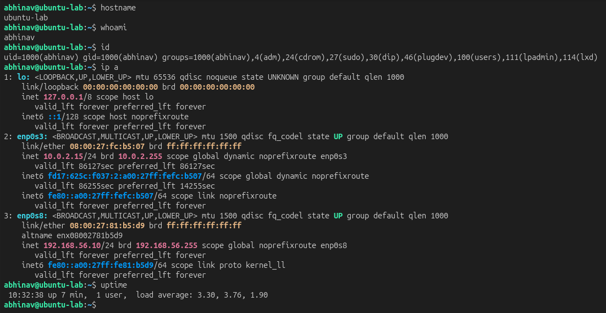
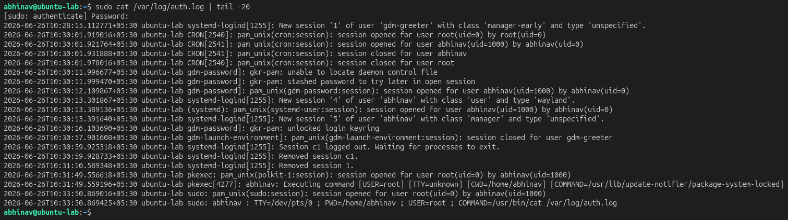

# Lab 21 – Incident Investigation Workflow

## Objective

Establish a structured Linux incident investigation workflow by collecting system information, reviewing security logs, and identifying indicators of suspicious activity.

---

## Investigation Scenario

A Linux server has been flagged for suspicious activity. The objective is to perform an initial investigation, collect evidence, and determine whether further analysis is required.

---

## Lab Environment

| Component     | Technology                    |
| ------------- | ----------------------------- |
| Target        | Ubuntu Server                 |
| Investigation | Linux Command Line            |
| Log Sources   | Syslog, Auth Logs, Audit Logs |
| Framework     | Incident Response Methodology |

---

## Initial Investigation

Basic system information was collected to understand the current state of the system.

```bash
hostname
whoami
id
uptime
ip a
```

### Initial Investigation Evidence

The investigation began by collecting system information to establish the operating environment and identify the current user context.



---

## Log Review

System logs were reviewed to identify authentication events and potential indicators of suspicious activity.

Examples:

```bash
sudo cat /var/log/auth.log
sudo journalctl
```

### Log Analysis Evidence

System authentication and event logs were reviewed to identify user activity and investigate potential security events.



---

## Evidence Collected

The investigation successfully gathered host information and reviewed available log sources to establish a baseline for subsequent threat hunting activities.

The collected evidence included:

* Current logged-in user
* Host information
* Network configuration
* Authentication logs
* System event logs

---

## Investigation Workflow

1. Collect host information.
2. Review authentication logs.
3. Review system logs.
4. Identify suspicious activity.
5. Document findings.
6. Determine next investigation steps.

---

## Detection Opportunities

* Monitor authentication failures.
* Review privileged account activity.
* Detect unusual login patterns.
* Correlate system events with user activity.

---

## Key Findings

* A structured investigation process was established.
* Host and user information were successfully collected.
* System logs provided valuable context for security analysis.
* Establishing an investigation baseline improves the effectiveness of future threat hunting activities.

---

## Skills Demonstrated

* Linux Incident Investigation
* Log Analysis
* Linux System Administration
* Security Investigation
* Evidence Collection
* Incident Response Methodology
