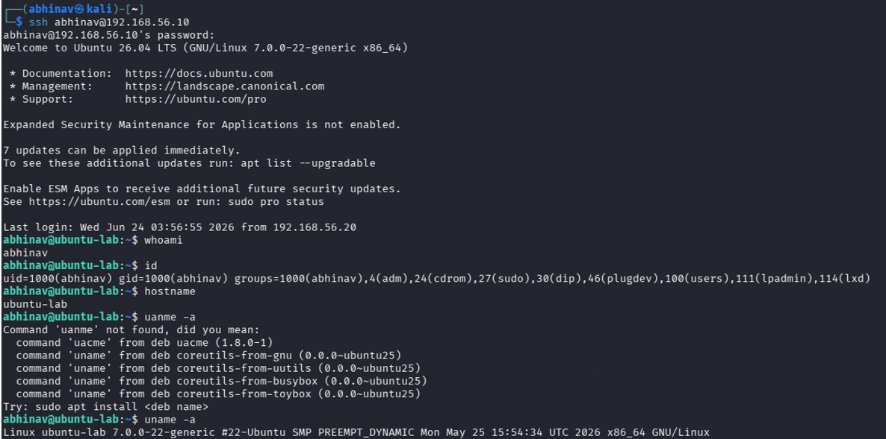
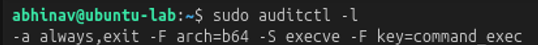
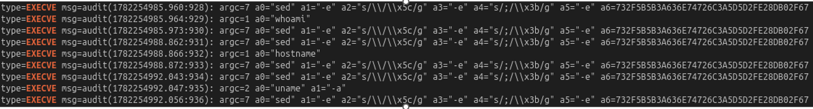

# Lab 22 – Hypothesis-Driven Threat Hunting

## Objective

Perform a hypothesis-driven threat hunt to determine whether an attacker executed reconnaissance commands on a compromised Linux system.

---

## Hunting Hypothesis

An attacker who gains access to a Linux server will perform reconnaissance activities to understand the environment before taking further actions.

---

## Lab Environment

| Component | Technology |
|----------|------------|
| Attacker | Kali Linux |
| Target | Ubuntu Server |
| Monitoring | Linux Auditd |
| Investigation | ausearch |
| Framework | MITRE ATT&CK |

---

## Attack Simulation

After establishing SSH access to the Ubuntu server, the following reconnaissance commands were executed:

```bash
whoami
hostname
id
```

### Attack Simulation Evidence

The attacker connected from Kali Linux to the Ubuntu target and executed basic reconnaissance commands to identify the current user, system hostname, and operating system details.



---

## Threat Hunting

Initially, no command execution telemetry was available because Auditd had no active monitoring rules.

Verified using:

```bash
sudo auditctl -l
```

A command execution monitoring rule was configured to capture Linux process execution events:

```bash
sudo auditctl -a always,exit -F arch=b64 -S execve -k command_exec
```

### Auditd Rule Configuration

Configured Auditd to monitor Linux command execution using the `execve` system call.



### Evidence Collection

Evidence was collected using:

```bash
sudo ausearch -k command_exec --raw
```

---

## Evidence Collected

Auditd successfully captured execution of the following reconnaissance commands:

- `whoami`
- `hostname`
- `id`

### Threat Hunting Evidence

Auditd successfully recorded the executed reconnaissance commands, validating the hunting hypothesis and confirming that command execution telemetry was available for investigation.



---

## MITRE ATT&CK Mapping

| Activity | Technique |
|----------|-----------|
| Account Discovery | T1033 – Account Discovery |
| System Information Discovery | T1082 – System Information Discovery |

The observed reconnaissance activity aligns with the **MITRE ATT&CK Discovery** tactic, where attackers gather information about the target system after gaining initial access.

---

## Detection Opportunities

- Monitor Linux command execution using Auditd.
- Detect reconnaissance commands executed immediately after SSH login.
- Correlate command execution with user authentication events.
- Alert on abnormal use of Linux system discovery utilities.

---

## Key Findings

- Initial investigation revealed that Auditd was not monitoring command execution.
- A custom Auditd rule was configured to capture `execve` system calls.
- Reconnaissance commands (`whoami`, `hostname`, and `id`) were successfully detected.
- The hunting hypothesis was validated using Linux audit logs.

---

## Skills Demonstrated

- Hypothesis-Driven Threat Hunting
- Linux Auditd Configuration
- Command Execution Monitoring
- Linux Log Analysis
- MITRE ATT&CK Mapping
- Threat Investigation