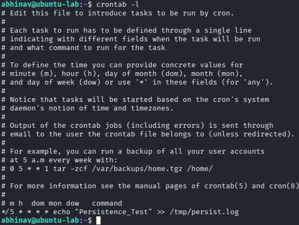
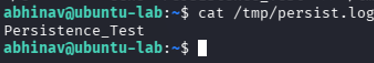

# Lab 23 – Cron Persistence Hunting

## Objective

Simulate a cron-based persistence mechanism and investigate how scheduled tasks can be identified during a Linux threat hunting investigation.

---

## Hunting Hypothesis

An attacker who gains access to a Linux system may create a cron job to maintain persistence and execute commands automatically at scheduled intervals.

---

## Lab Environment

| Component     | Technology        |
| ------------- | ----------------- |
| Attacker      | Kali Linux        |
| Target        | Ubuntu Server     |
| Monitoring    | Linux Auditd      |
| Investigation | crontab, ausearch |
| Framework     | MITRE ATT&CK      |

---

## Attack Simulation

A cron job was created on the Ubuntu server to simulate attacker persistence.

```bash
crontab -e
```

Example cron entry:

```text
* * * * * echo "Persistence Test" >> /tmp/persistence.log
```

### Attack Simulation Evidence

The cron job was successfully created to simulate scheduled task persistence.


---

## Threat Hunting

The scheduled task was verified using:

```bash
crontab -l
```

### Persistence Verification

The configured cron job was identified during investigation.



Evidence of command execution was reviewed using:

```bash
sudo ausearch -k command_exec --raw
```

---

## Evidence Collected

The investigation confirmed the presence of the scheduled task configured for persistence.

### Threat Hunting Evidence

Audit logs and cron configuration validated the persistence mechanism.



---

## MITRE ATT&CK Mapping

| Activity             | Technique                            |
| -------------------- | ------------------------------------ |
| Cron Job Persistence | T1053.003 – Scheduled Task/Job: Cron |

The observed activity aligns with the **Persistence** tactic of the MITRE ATT&CK framework, demonstrating how attackers can maintain access through scheduled tasks.

---

## Detection Opportunities

* Monitor creation and modification of cron jobs.
* Audit changes to user crontab entries.
* Detect unusual scheduled task creation.
* Correlate cron modifications with recent user logins.

---

## Key Findings

* A cron job was successfully created to simulate persistence.
* Scheduled task persistence was verified using `crontab -l`.
* Persistence artifacts can be identified through cron configuration reviews.
* Scheduled task monitoring is an effective method for detecting Linux persistence techniques.

---

## Skills Demonstrated

* Linux Persistence Hunting
* Cron Investigation
* Linux Threat Hunting
* Audit Log Analysis
* MITRE ATT&CK Mapping

