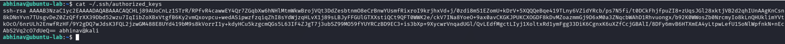
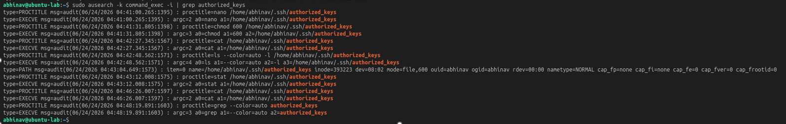

# Lab 24 – SSH Persistence Hunting

## Objective

Simulate SSH-based persistence by reviewing the `authorized_keys` file and investigate how SSH key-based persistence can be identified during a Linux threat hunting investigation.

---

## Hunting Hypothesis

An attacker who gains access to a Linux system may establish persistence by adding their public SSH key to the `authorized_keys` file, enabling passwordless access for future logins.

---

## Lab Environment

| Component     | Technology                     |
| ------------- | ------------------------------ |
| Attacker      | Kali Linux                     |
| Target        | Ubuntu Server                  |
| Monitoring    | Linux Auditd                   |
| Investigation | SSH, authorized_keys, ausearch |
| Framework     | MITRE ATT&CK                   |

---

## Attack Simulation

The SSH `authorized_keys` file was reviewed to identify configured public keys used for SSH authentication.

```bash
cat ~/.ssh/authorized_keys
```

### Attack Simulation Evidence

The `authorized_keys` file was inspected to review SSH public keys configured for remote access.



---

## Threat Hunting

The investigation focused on identifying evidence of SSH persistence by reviewing access to the `authorized_keys` file.

Auditd command execution logs were searched using:

```bash
sudo ausearch -k command_exec -i | grep authorized_keys
```

---

## Evidence Collected

Auditd successfully captured command execution related to reviewing the `authorized_keys` file. The investigation confirmed that SSH persistence artifacts could be identified through Linux audit logs.

### Threat Hunting Evidence

The Auditd investigation below shows recorded access to the `authorized_keys` file during the hunting process.



---

## MITRE ATT&CK Mapping

| Activity            | Technique                                             |
| ------------------- | ----------------------------------------------------- |
| SSH Authorized Keys | T1098.004 – Account Manipulation: SSH Authorized Keys |

The observed activity aligns with the **Persistence** tactic in the MITRE ATT&CK framework, demonstrating how attackers can maintain long-term access using SSH key authentication.

---

## Detection Opportunities

* Monitor changes to the `authorized_keys` file.
* Detect unauthorized SSH key additions.
* Audit access to the `.ssh` directory.
* Correlate SSH authentication events with file modification activity.

---

## Key Findings

* The `authorized_keys` file was successfully reviewed during the investigation.
* Auditd captured command execution related to SSH key inspection.
* SSH key persistence can be identified through Linux audit logs and file monitoring.
* Continuous monitoring of SSH configuration files helps detect unauthorized persistence mechanisms.

---

## Skills Demonstrated

* SSH Persistence Hunting
* Linux Threat Hunting
* Linux Auditd
* Command Execution Monitoring
* Linux Log Analysis
* MITRE ATT&CK Mapping
