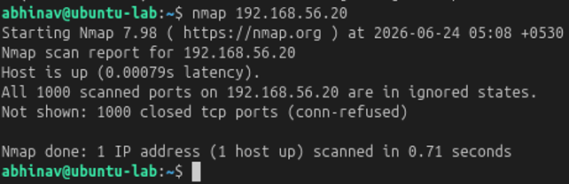
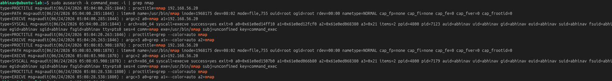

# Lab 25 – Lateral Movement & Network Discovery

## Objective

Simulate network discovery activity from a compromised Linux system and investigate how reconnaissance commands can be detected using Linux Auditd.

---

## Hunting Hypothesis

An attacker who gains access to a Linux system will likely enumerate the surrounding network to identify additional hosts and potential lateral movement opportunities.

---

## Lab Environment

| Component     | Technology     |
| ------------- | -------------- |
| Attacker      | Ubuntu Server  |
| Target        | Kali Linux     |
| Monitoring    | Linux Auditd   |
| Investigation | Nmap, ausearch |
| Framework     | MITRE ATT&CK   |

---

## Attack Simulation

A network scan was performed from the Ubuntu server to identify reachable hosts and open services.

```bash
nmap 192.168.56.20
```

### Attack Simulation Evidence

The Ubuntu server performed network reconnaissance by scanning the Kali Linux system using Nmap.



---

## Threat Hunting

The investigation focused on identifying execution of network discovery tools.

Auditd logs were searched using:

```bash
sudo ausearch -k command_exec -i | grep nmap
```

---

## Evidence Collected

Auditd successfully captured execution of the Nmap command, confirming that network discovery activity occurred on the system.

### Threat Hunting Evidence

The investigation confirmed execution of the Nmap reconnaissance command through Linux Auditd logs.



---

## MITRE ATT&CK Mapping

| Activity                  | Technique                         |
| ------------------------- | --------------------------------- |
| Network Service Discovery | T1046 – Network Service Discovery |

The observed activity aligns with the **Discovery** tactic in the MITRE ATT&CK framework, where attackers identify accessible systems and services before attempting lateral movement.

---

## Detection Opportunities

* Monitor execution of network discovery utilities such as `nmap`.
* Alert on reconnaissance activity originating from production servers.
* Correlate network scans with recent authentication events.
* Investigate unusual outbound scanning activity.

---

## Key Findings

* Network reconnaissance was successfully simulated using Nmap.
* Auditd captured execution of the network scanning command.
* Nmap activity provides valuable indicators of potential lateral movement preparation.
* Monitoring execution of reconnaissance tools improves early threat detection.

---

## Skills Demonstrated

* Network Discovery Hunting
* Linux Threat Hunting
* Linux Auditd
* Command Execution Monitoring
* Network Reconnaissance Detection
* MITRE ATT&CK Mapping

