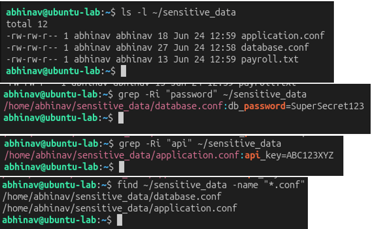
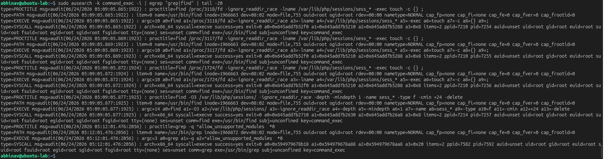

# Lab 26 – Credential Access & Sensitive Data Hunting

## Objective

Simulate credential discovery activities on a Linux system and investigate how searches for sensitive information can be detected using Linux Auditd.

---

## Hunting Hypothesis

An attacker who gains access to a Linux system will search for credentials, configuration files, API keys, passwords, and SSH keys to facilitate privilege escalation or lateral movement.

---

## Lab Environment

| Component     | Technology           |
| ------------- | -------------------- |
| Attacker      | Ubuntu Server        |
| Target        | Ubuntu Server        |
| Monitoring    | Linux Auditd         |
| Investigation | grep, find, ausearch |
| Framework     | MITRE ATT&CK         |

---

## Attack Simulation

Sensitive information was searched using common Linux utilities.

```bash
grep -Ri "password" ~/sensitive_data
grep -Ri "api" ~/sensitive_data
find ~/sensitive_data -name "*.conf"
find /home -name "id_rsa"
```

### Attack Simulation Evidence

Common attacker reconnaissance techniques were used to locate credentials, configuration files, API keys, and SSH private keys.



---

## Threat Hunting

Auditd logs were reviewed to identify execution of credential discovery commands.

Evidence was collected using:

```bash
sudo ausearch -k command_exec -i | egrep "grep|find"
```

---

## Evidence Collected

Auditd successfully captured execution of the credential discovery commands performed during the investigation.

### Threat Hunting Evidence

The investigation confirmed execution of `grep` and `find` commands used to search for passwords, API keys, configuration files, and SSH keys.



---

## MITRE ATT&CK Mapping

| Activity                     | Technique                            |
| ---------------------------- | ------------------------------------ |
| File and Directory Discovery | T1083 – File and Directory Discovery |
| Unsecured Credentials        | T1552 – Unsecured Credentials        |

The observed activity aligns with the **Credential Access** and **Discovery** tactics within the MITRE ATT&CK framework, where attackers search the filesystem for credentials and sensitive configuration data.

---

## Detection Opportunities

* Monitor execution of `grep` and `find` against sensitive directories.
* Detect searches targeting passwords, API keys, and SSH private keys.
* Alert on unusual file enumeration activity.
* Correlate credential discovery with recent authentication events.

---

## Key Findings

* Credential discovery activity was successfully simulated.
* Auditd captured execution of Linux search utilities.
* Searches targeting passwords, API keys, and configuration files were identified.
* Monitoring file discovery activity provides valuable visibility into post-compromise behavior.

---

## Skills Demonstrated

* Credential Access Hunting
* Linux Threat Hunting
* Linux Auditd
* File Discovery Analysis
* Command Execution Monitoring
* MITRE ATT&CK Mapping

