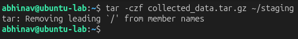
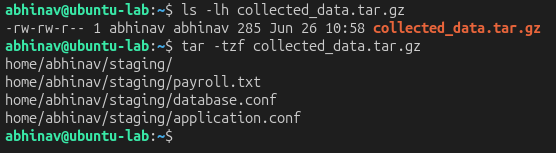

# Lab 27 – Data Staging & Collection Hunting

## Objective

Simulate data staging activities on a Linux system by collecting sensitive files into a compressed archive and investigate how staged data can be identified during a security investigation.

---

## Hunting Hypothesis

After identifying sensitive files, an attacker will collect and consolidate them into an archive before attempting data exfiltration.

---

## Lab Environment

| Component | Technology |
|----------|------------|
| Attacker | Ubuntu Server |
| Target | Ubuntu Server |
| Monitoring | Linux Auditd |
| Investigation | tar, ls |
| Framework | MITRE ATT&CK |

---

## Attack Simulation

Sensitive files were archived into a compressed file to simulate attacker data staging.

```bash
tar -czf collected_data.tar.gz ~/staging
```

### Attack Simulation Evidence

The `tar` utility was used to collect multiple sensitive files into a single compressed archive, simulating a common attacker data staging technique.



---

## Threat Hunting

The generated archive was examined to verify that the expected files had been successfully staged.

Verification commands:

```bash
ls -lh collected_data.tar.gz
tar -tzf collected_data.tar.gz
```

---

## Evidence Collected

The investigation confirmed that the archive was successfully created and contained the expected files prepared for collection.

### Archive Verification

The archive contents were reviewed to validate that sensitive files had been successfully staged into a single compressed package.



---

## MITRE ATT&CK Mapping

| Activity | Technique |
|----------|-----------|
| Data Staged | T1074 – Data Staged |
| Archive Collected Data | T1560.001 – Archive via Utility |

The observed activity aligns with the **Collection** tactic of the MITRE ATT&CK framework, demonstrating how attackers prepare files before attempting exfiltration.

---

## Detection Opportunities

- Monitor execution of archive utilities such as `tar`.
- Detect creation of compressed archives in unusual directories.
- Alert on collection of multiple sensitive files into a single archive.
- Correlate archive creation with prior credential discovery or file enumeration activity.

---

## Key Findings

- Sensitive files were successfully collected into a compressed archive.
- Archive verification confirmed the expected files were staged.
- Data staging is a common attacker technique prior to exfiltration.
- Monitoring archive creation provides valuable visibility into post-compromise collection activities.

---

## Skills Demonstrated

- Data Staging Investigation
- Linux Threat Hunting
- Archive Analysis
- File Collection Detection
- MITRE ATT&CK Mapping