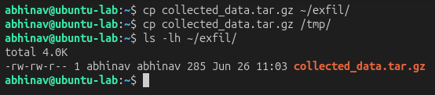
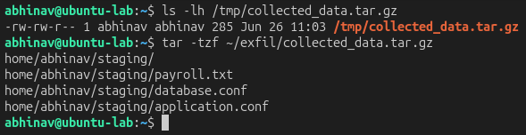

# Lab 28 – Exfiltration Detection Concepts

## Objective

Simulate the movement of staged data to an exfiltration location and investigate indicators that may suggest data exfiltration on a Linux system.

---

## Hunting Hypothesis

After collecting and staging sensitive information, an attacker will move the archive to another location before attempting data exfiltration.

---

## Lab Environment

| Component | Technology |
|----------|------------|
| Attacker | Ubuntu Server |
| Target | Ubuntu Server |
| Monitoring | Linux Auditd |
| Investigation | cp, ls, tar |
| Framework | MITRE ATT&CK |

---

## Attack Simulation

The staged archive was copied to another directory to simulate preparation for data exfiltration.

```bash
cp collected_data.tar.gz ~/exfil/
cp collected_data.tar.gz /tmp/
```

### Attack Simulation Evidence

The staged archive was moved to alternate locations, simulating attacker preparation prior to exfiltration.



---

## Threat Hunting

The copied archive was verified to confirm that the staged data had been successfully transferred.

Verification commands:

```bash
ls -lh ~/exfil/
ls -lh /tmp/collected_data.tar.gz
tar -tzf ~/exfil/collected_data.tar.gz
```

---

## Evidence Collected

The investigation confirmed that the staged archive was successfully copied and remained intact after transfer.

### Transfer Verification

Inspection of the transferred archive verified that the expected files were successfully prepared for potential exfiltration.



---

## MITRE ATT&CK Mapping

| Activity | Technique |
|----------|-----------|
| Data Transfer | T1020 – Automated Exfiltration |
| Data Staged | T1074 – Data Staged |

The observed activity aligns with the **Exfiltration** tactic of the MITRE ATT&CK framework, demonstrating how attackers prepare and move collected data before sending it outside the environment.

---

## Detection Opportunities

- Monitor movement of archive files between directories.
- Detect unexpected copies of sensitive files to temporary locations.
- Alert on archive creation followed by file transfer activity.
- Correlate file movement with previous credential discovery or data staging events.

---

## Key Findings

- The staged archive was successfully transferred to alternate locations.
- Archive verification confirmed file integrity after transfer.
- Data movement provides valuable indicators of potential exfiltration preparation.
- Monitoring archive transfers improves visibility into attacker collection workflows.

---

## Skills Demonstrated

- Exfiltration Investigation
- Linux Threat Hunting
- File Movement Analysis
- Archive Verification
- MITRE ATT&CK Mapping