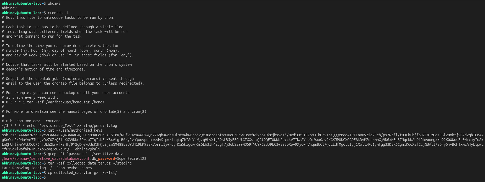
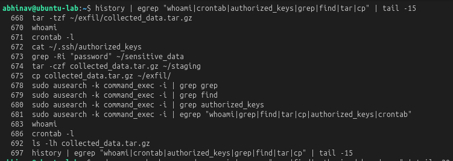

# Lab 29 – End-to-End Attack Chain Simulation

## Objective

Simulate a complete Linux attack chain by combining reconnaissance, persistence, credential discovery, data staging, and exfiltration preparation into a single investigation scenario.

---

## Investigation Scenario

A Linux server is suspected of compromise. The objective is to reconstruct the attack timeline, identify attacker techniques, and correlate the collected evidence from multiple phases of the attack.

---

## Lab Environment

| Component | Technology |
|----------|------------|
| Attacker | Ubuntu Server |
| Target | Ubuntu Server |
| Monitoring | Linux Auditd |
| Investigation | Linux Command Line |
| Framework | MITRE ATT&CK |

---

## Attack Chain Simulation

The following attacker activities were performed during the simulation:

- Reconnaissance
- Cron Persistence
- SSH Authorized Keys Review
- Credential Discovery
- Data Staging
- Exfiltration Preparation

Representative commands:

```bash
whoami
crontab -l
cat ~/.ssh/authorized_keys
grep -Ri "password" ~/sensitive_data
tar -czf collected_data.tar.gz ~/staging
cp collected_data.tar.gz ~/exfil/
```

### Attack Chain Overview

The simulated attack demonstrates how multiple Linux attacker techniques can be chained together during a compromise.



---

## Investigation Summary

The attack chain was reconstructed by reviewing the executed commands and correlating each activity to its corresponding attack phase.

### Investigation Evidence

The investigation timeline illustrates the progression from reconnaissance through persistence, credential discovery, data staging, and exfiltration preparation.



---

## MITRE ATT&CK Mapping

| Attack Phase | Technique |
|--------------|-----------|
| Account Discovery | T1033 |
| System Information Discovery | T1082 |
| Scheduled Task / Cron | T1053.003 |
| SSH Authorized Keys | T1098.004 |
| Unsecured Credentials | T1552 |
| Data Staged | T1074 |
| Archive via Utility | T1560.001 |
| Automated Exfiltration | T1020 |

The investigation demonstrates how individual MITRE ATT&CK techniques combine to form a complete Linux attack chain.

---

## Detection Opportunities

- Correlate multiple attacker techniques instead of isolated events.
- Detect persistence followed by credential discovery.
- Monitor archive creation and subsequent file movement.
- Identify sequential attacker behavior across the attack lifecycle.

---

## Key Findings

- A complete Linux attack chain was successfully simulated.
- Multiple attacker techniques were reconstructed into a single investigation timeline.
- Correlating related events provides greater investigative context than analyzing isolated activities.
- Understanding attacker progression improves detection and incident response.

---

## Skills Demonstrated

- End-to-End Threat Hunting
- Linux Incident Investigation
- Attack Chain Reconstruction
- MITRE ATT&CK Mapping
- Evidence Correlation
- Blue Team Investigation