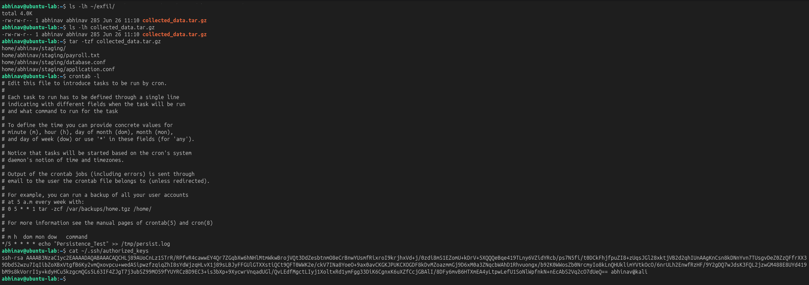
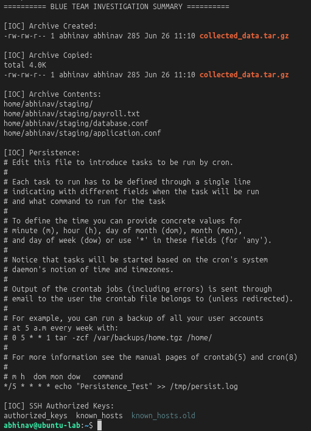

# Lab 30 – Blue Team Capstone Investigation

## Objective

Conduct a complete Blue Team investigation by analyzing the simulated Linux attack chain, identifying indicators of compromise (IOCs), reconstructing attacker activity, and documenting the incident from initial access through exfiltration preparation.

---

## Investigation Scenario

A Linux server exhibited signs of suspicious activity. Multiple attacker techniques were suspected, including reconnaissance, persistence, credential discovery, data staging, and exfiltration preparation.

The objective was to investigate the available evidence, reconstruct the attack timeline, and document the complete incident.

---

## Lab Environment

| Component | Technology |
|----------|------------|
| Target | Ubuntu Server |
| Investigation | Linux Command Line |
| Monitoring | Linux Auditd |
| Framework | MITRE ATT&CK |

---

## Incident Investigation

The investigation focused on identifying evidence from each phase of the simulated attack.

Evidence reviewed included:

- System reconnaissance
- Cron persistence
- SSH authorized keys
- Credential discovery
- Data staging
- Exfiltration preparation

Representative investigation commands:

```bash
ls -lh ~/exfil/

ls -lh collected_data.tar.gz

tar -tzf collected_data.tar.gz

crontab -l

cat ~/.ssh/authorized_keys
```

### Investigation Evidence

Evidence collected during the investigation confirmed the presence of staged archives, persistence mechanisms, and SSH configuration artifacts associated with the simulated attack.



---

## Incident Timeline

| Phase | Activity |
|--------|----------|
| Discovery | System Reconnaissance |
| Persistence | Cron Job Created |
| Persistence | SSH Authorized Keys |
| Credential Access | Sensitive Data Search |
| Collection | Archive Creation |
| Exfiltration Preparation | Archive Transfer |

---

## Indicators of Compromise (IOCs)

The following indicators were identified during the investigation:

- Unexpected cron entries
- SSH authorized keys configured for remote access
- Searches targeting passwords and configuration files
- Creation of `collected_data.tar.gz`
- Archive copied to the exfiltration directory

### Investigation Summary

The investigation concluded with a review of key Indicators of Compromise (IOCs), including staged archives, persistence artifacts, and SSH configuration, providing a consolidated view of the simulated incident.



---

## MITRE ATT&CK Mapping

| ATT&CK Tactic | Technique |
|--------------|-----------|
| Discovery | T1033 – Account Discovery |
| Discovery | T1082 – System Information Discovery |
| Persistence | T1053.003 – Scheduled Task/Job: Cron |
| Persistence | T1098.004 – SSH Authorized Keys |
| Credential Access | T1552 – Unsecured Credentials |
| Collection | T1074 – Data Staged |
| Collection | T1560.001 – Archive via Utility |
| Exfiltration | T1020 – Automated Exfiltration |

The investigation successfully reconstructed the complete attacker workflow by correlating evidence across multiple MITRE ATT&CK tactics and techniques.

---

## Detection Opportunities

- Detect abnormal Linux command execution.
- Monitor modifications to cron jobs.
- Alert on changes to SSH authorized keys.
- Detect credential discovery activity.
- Monitor archive creation and movement.
- Correlate multiple attacker techniques into a single investigation timeline.

---

## Key Findings

- Successfully reconstructed a complete Linux attack lifecycle.
- Correlated evidence across multiple MITRE ATT&CK tactics.
- Identified Indicators of Compromise (IOCs) associated with each attack phase.
- Demonstrated an end-to-end Blue Team investigation workflow for Linux environments.

---

## Skills Demonstrated

- Blue Team Investigation
- Linux Threat Hunting
- Incident Response
- Timeline Reconstruction
- Evidence Correlation
- Linux Forensics
- MITRE ATT&CK Mapping
- Linux Auditd Analysis